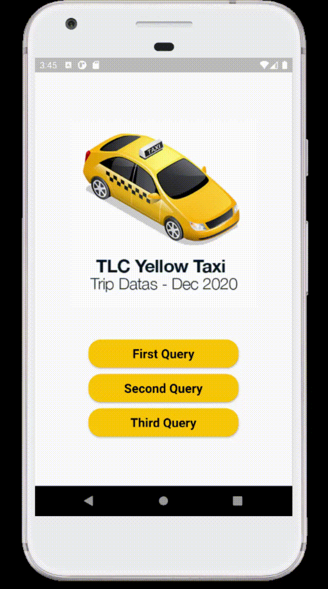

= Google Maps in Flutter

== Used APIs and SDK
* Cloud Function API
* BigQuery API
* Maps SDK for Android
* Directions API

== Datas

https://www1.nyc.gov/site/tlc/about/tlc-trip-record-data.page[TLC Trip Record Data]

* Yellow Taxi Trip Records - December 2020
* Taxi Zone Lookup Table

== Cloud Functions
* https://github.com/tayfunkscu/google-maps-flutter/blob/main/cloud_functions/firstQuery.js[First Query]
* https://github.com/tayfunkscu/google-maps-flutter/blob/main/cloud_functions/secondQuery.js[Second Query]
* https://github.com/tayfunkscu/google-maps-flutter/blob/main/cloud_functions/thirdQuery.js[Third Query]

== Queries

*1. Top 5 days which has the most passenger count*

*2. 5 trips that have least distance between selected dates*

*3. Draw the route on the map of the longest trip on a given day*

image::img/q3.gif[width=250]